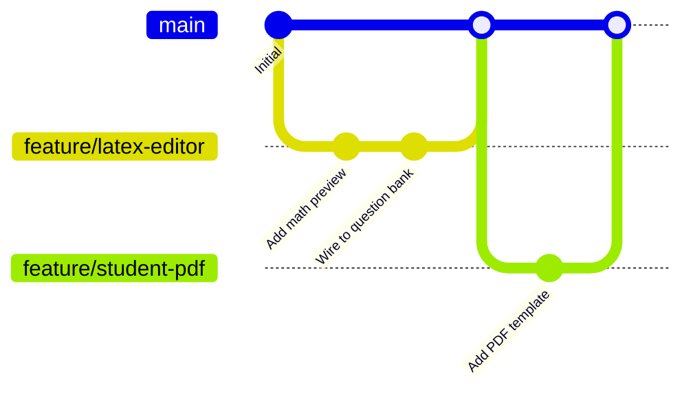

# Contributing & Team Development Guidelines

> Rules and best practices for developing the CBT platform together using Git, GitHub, and Antigravity (AI Coding Assistant).

---

## 1. Golden Rules of Pair-Programming with AI

Antigravity makes rapid, broad multi-file changes. When two developers both use AI assistants on the same repository, uncoordinated edits will cause massive merge conflicts. Follow these golden rules:

1. **Never work on the exact same file simultaneously**.
   - Divide work cleanly by feature or module (e.g., Person A builds the LaTeX Question Editor; Person B builds the Student Analytics Export).
2. **Tell Antigravity to keep changes strictly localized**.
   - Include this in prompts: *"Only modify the specific files required for this feature. Do not refactor unrelated layouts, styles, or configuration files."*
3. **Always build before committing**.
   - Run `npm run build --workspace=client` and `npm run build --workspace=server`. Never push broken TypeScript types to a branch.
4. **Never commit `.env` or sensitive credentials**.
   - Always verify `git status` before `git add .`.

---

## 2. Git Branch Workflow

We use a standard **Feature Branch Workflow**:



### Daily Workflow Steps

#### Step 1: Start on an Updated `main`
```bash
git checkout main
git pull origin main
```

#### Step 2: Create a Dedicated Feature Branch
```bash
git checkout -b feature/your-feature-name
```
Branch naming conventions:
- `feature/<name>` — New capabilities (e.g., `feature/question-csv-import`)
- `fix/<name>` — Bug fixes (e.g., `fix/timer-sync-drift`)
- `ui/<name>` — Visual design updates (e.g., `ui/scorecard-print-styles`)

#### Step 3: Develop with Antigravity & Test Locally
Work on your feature. Once complete, run:
```bash
# Verify both client and server compile cleanly
npm run build --workspace=client
npm run build --workspace=server
```

#### Step 4: Commit with Conventional Messages
```bash
git add .
git commit -m "feat(proctor): add audio anomaly indicator to candidate dossier"
```

#### Step 5: Push and Open a Pull Request (PR)
```bash
git push -u origin feature/your-feature-name
```
Open a PR on GitHub, tag your teammate for review, and click **Merge** once approved.

---

## 3. Database & Prisma Schema Changes

When modifying database tables in `server/prisma/schema.prisma`:

1. **Do NOT use `db push` on shared feature branches**.
2. **Generate a migration**:
   ```bash
   cd server
   npx prisma migrate dev --name <describe_change>
   npx prisma generate
   ```
   This generates an actual SQL file inside `server/prisma/migrations/` that you commit to Git.
3. **When you pull your teammate's migrations**:
   ```bash
   git pull origin main
   cd server
   npx prisma migrate dev
   npx prisma generate
   ```
   Your local database will automatically sync without losing data.

---

## 4. Design System Compliance

Any UI you add or modify must follow the **Vintage Technical Instrument & Academic Journal** theme specified in [`.antigravity/rules.md`](file:///.antigravity/rules.md):
- Backgrounds: `#FBF9F5` (Parchment), Inset wells `#F4EFEA`
- Borders: Crisp ink `#1C1D21` with `.shadow-tactile` (`shadow-[2px_2px_0px_0px_#1C1D21]`)
- Buttons: `.btn-tactile` with mechanical depression on active state
- Fonts: `font-serif` for titles, `font-mono` for metrics/telemetry, `font-sans` for question copy
- Colors: Deep Royal Ink `#1A2B4C`, Vintage Ochre `#C88A2D`, Muted Emerald `#236B47`, Muted Crimson `#A83232`.
